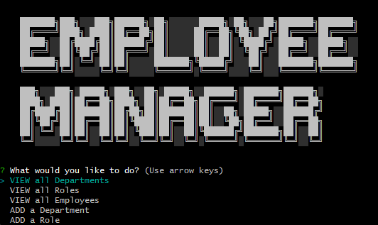

# LUMINOUS-CASCADE

## Description

The Employee Tracker - This is a Node.js application designed to be used to store tables of data and display/modify them within a terminal window. It is setup with base tables; Department, Role, and Employee, but you are free to edit them to fulfill your needs.

## Installation

Link to video walkthrough: https://watch.screencastify.com/v/clou8mjGycllJnrTzAJb

Setup Steps:
-Clone repository or download & unzip zip file. 
-Load schema.sql and seeds.sql into a SQL editor; MySQL Workbench, HeidiSQL, Etc.
-In terminal to main directory, " npm install " to install packages.
-In same terminal, " node server.js ".

## Usage

The application will greet the user with prompts, make a selection to view one of the tables or to add to one of the tables. There is logic in place to edit existing Employees as well.

## License 
Visit [GPL License](https://www.gnu.org/licenses/gpl-3.0) for all information about this license

## How to Contribute

N/A

## Questions

For any questions, please contact me:

- GitHub: [imshocker](https://github.com/imshocker)